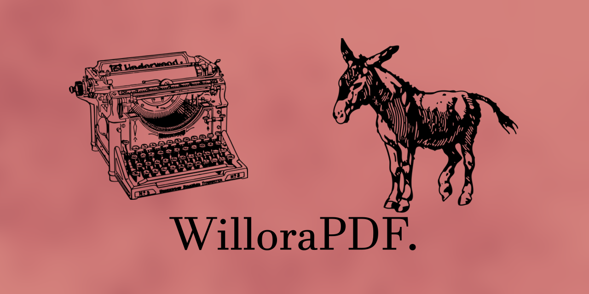

# WilloraPDF

**WilloraPDF** is a free and open source document preparation system for
professional publishing, brought to you by [Magenta Stripe Media][1].

It is a collection of themes, tools and other goodies for
[Asciidoctor-PDF][2]. **WilloraPDF is designed to empower self-publishers**
and lower the barrier to entry for authors who want their work
professionally printed.

It is currently a **work in progress,** being developed alongside my debut
novel. Version 1.0 of WilloraPDF will be released when the first paperback
and/or hardcover editions are printed for my book! Then you'll know for certain
that WilloraPDF _can_ be used to publish actual, real-life books.

## Use cases

- Typesetting for printed text with no (or very few) illustrations
- Render PDFs for local home printing or actual bookbinding
- Generate properly formatted manuscripts

## How it works

1. Write your book in the [AsciiDoc][3] markup language
2. Choose a theme, trim size and other settings
3. Feed your book into WilloraPDF
4. A good-looking PDF document comes out!

[1]: https://magentastripe.com/
[2]: https://docs.asciidoctor.org/pdf-converter/latest/
[3]: https://asciidoctor.org/
